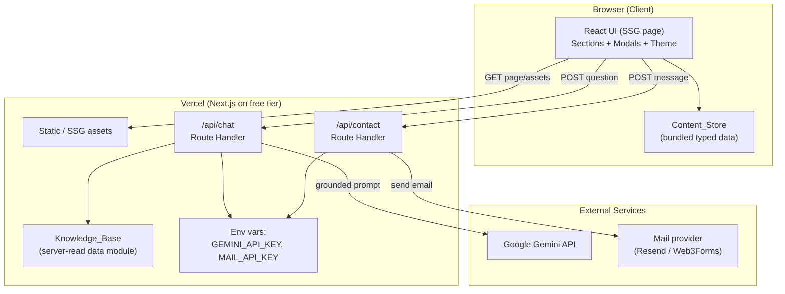
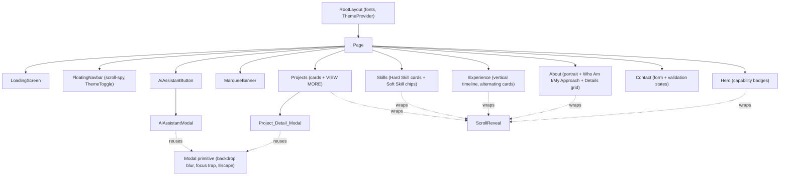

# Design Document: Portfolio Website

## Overview

The Portfolio_Site is a single-page portfolio web application that recreates the provided monochrome-minimalist reference design exactly. It presents a branded loading intro, a floating pill navbar with scroll-spy and theme toggle, a hero, about, experience timeline, marquee banner, skills, projects (with a detail modal), and a contact form. A persistent floating AI assistant answers visitor questions grounded strictly in an owner-controlled Knowledge_Base.

The application is built with **Next.js (App Router) + React + TypeScript** and styled with **Tailwind CSS**. It renders as a mostly static (SSG) page for fast first paint, and uses two serverless Route Handlers for the two pieces of dynamic behavior that must keep secrets off the client: `/api/chat` (AI assistant, backed by Google Gemini) and `/api/contact` (contact form, backed by an email provider). Both are deployed on Vercel's always-free tier.

Two editable data modules drive everything:

- **Content_Store** — typed TypeScript modules holding all section content (hero, about, personal details, experience, skills, projects, marquee, social links, CV reference, headings/eyebrows). Fully editable by the Owner without touching component code. (Requirement 14)
- **Knowledge_Base** — a separate editable module read only by `/api/chat` to ground Gemini responses. (Requirement 13)

### Design Goals and Rationale

- **Static-first with serverless edges.** The portfolio is content that rarely changes, so SSG gives the fastest load and best free-tier economics. Only the AI and contact features need a server, and those become small Route Handlers. This keeps the entire app on Vercel's free tier with no trial expiry.
- **Secrets never reach the browser.** The Gemini and mail keys live only in Vercel environment variables and are used only inside Route Handlers. The browser calls the site's own same-origin API routes. (Requirement 13, security)
- **Provider abstraction.** `AiProvider` and `MailProvider` interfaces isolate the external services so Gemini can be swapped for Groq/OpenRouter (or a local retrieval fallback) and the mail provider swapped, without touching UI code.
- **Content/behavior separation.** All copy and imagery come from the Content_Store; components read typed data and never hardcode content. (Requirement 14)
- **Reference fidelity.** A centralized Tailwind theme encodes the exact Design_Tokens (colors, radii, shadows, typography) so every surface matches the reference. (Requirement 18)

### Technology Summary

| Concern | Choice | Why |
| --- | --- | --- |
| Framework | Next.js App Router (React + TypeScript) | SSG + serverless routes on one platform |
| Styling | Tailwind CSS with custom theme tokens | Encodes reference palette/radii/shadows centrally (Req 18) |
| Fonts | `next/font` "Plus Jakarta Sans" (400–800), Inter fallback | Matches reference typography (Req 18.4) |
| Animation | Framer Motion | Declarative, respects reduced motion, no bounce/spin needed (Req 17) |
| Hosting | Vercel free tier | Static + serverless, no trial expiry |
| AI | Google Gemini free tier (flash model) behind `AiProvider` | Free grounded chat, swappable (Req 13) |
| Email | Resend / Web3Forms free tier behind `MailProvider` | Free contact delivery, swappable (Req 9) |

## Architecture

### System Architecture



Key points:

- The browser only ever talks to same-origin routes. It never holds a provider key.
- `/api/chat` reads the Knowledge_Base, builds a grounded system prompt, and calls Gemini through the `AiProvider` abstraction. (Requirement 13)
- `/api/contact` validates input, applies spam/rate protection, and sends via the `MailProvider` abstraction. (Requirement 9)
- The Content_Store is bundled into the client build (public content); the Knowledge_Base is read server-side by the chat route.

### Rendering & Data Flow

1. **Initial load:** Next.js serves the SSG page. The Loading_Screen renders immediately (within 100 ms) as part of the initial HTML/CSS, overlaying content, until the app signals ready or the 5 s cap elapses. (Requirement 1)
2. **Content:** All sections import typed data from the Content_Store at build time. Missing fields are handled by per-section omission/placeholder logic (Requirements 3.2, 4.2/4.6, 5.6/5.7, 7.7/7.8, 8.7/8.8, 14.4).
3. **Chat:** Composer POSTs `{ question, history }` to `/api/chat`; the route returns `{ answer }` or a "not available" / error message. (Requirements 12, 13)
4. **Contact:** Form POSTs validated fields to `/api/contact`; the route returns success/failure. (Requirement 9)

### Project Structure

```
portfolio/
├─ app/
│  ├─ layout.tsx              # Root layout, fonts, ThemeProvider, metadata
│  ├─ page.tsx                # Single page: composes all sections
│  ├─ globals.css             # Tailwind base + CSS variables for themes
│  └─ api/
│     ├─ chat/route.ts        # POST handler → AiProvider (Gemini)
│     └─ contact/route.ts     # POST handler → MailProvider
├─ src/
│  ├─ components/
│  │  ├─ layout/              # LoadingScreen, FloatingNavbar, ThemeToggle
│  │  ├─ sections/            # Hero, About, Experience, Marquee, Skills,
│  │  │                       #   Projects, Contact
│  │  ├─ ai/                  # AiAssistantButton, AiAssistantModal, chat parts
│  │  └─ ui/                  # Modal, Button, Card, SectionHeading, Pill,
│  │                          #   Chip, ScrollReveal, StatusDot
│  ├─ content/
│  │  ├─ site-content.ts      # Content_Store (typed)
│  │  ├─ knowledge-base.ts    # Knowledge_Base (server-read)
│  │  └─ types.ts             # Content interfaces
│  ├─ lib/
│  │  ├─ ai/                  # AiProvider interface + GeminiProvider + prompt
│  │  ├─ mail/                # MailProvider interface + provider impl
│  │  ├─ validation.ts        # Email + form validation (pure)
│  │  ├─ scroll-spy.ts        # Active-section computation (pure)
│  │  └─ theme.ts             # Theme resolution/persistence helpers
│  └─ hooks/                  # useTheme, useScrollSpy, useReducedMotion,
│                             #   useScrollReveal, useFocusTrap
└─ public/                    # Portrait, project thumbnails, CV file
```

### Component Hierarchy



### Cross-Cutting Concerns

**Animation approach — Framer Motion (chosen).** Framer Motion is selected over hand-rolled CSS transitions because entrance/stagger/exit orchestration (Hero staggered badges, experience card stagger, modal enter/exit timing) is expressive and centralized, and because its `useReducedMotion` hook plus variant gating makes honoring `prefers-reduced-motion` a single, testable code path. The animation vocabulary is deliberately constrained to fade (opacity 0→1), translate (≤24 px), stagger (50–150 ms), and scale (0.95–1.0), each completing within 600 ms — no bounce, spin, 3D, or parallax beyond 24 px. (Requirement 17) Hover lift (2–8 px within 300 ms) and card hover effects use CSS transitions for cheapness. All reveal/marquee/hover motion is disabled and rendered in final static state when Reduced_Motion_Preference is enabled. (Requirements 1.5, 4.8, 6.4, 17.4)

**Scroll-spy + smooth scrolling.** A `useScrollSpy` hook observes section elements with IntersectionObserver and marks a section active while it occupies ≥50% of viewport height; the navbar reflects exactly one active link. (Requirement 2.4) Navigation uses smooth scrolling completing within 1000 ms. (Requirements 2.3, 3.4)

**Accessibility.** Semantic landmarks and a single `<h1>` with no skipped heading levels (Req 16.1); full keyboard operability of navbar and AI assistant, including Escape-to-close (Req 16.2, 8.10, 12.9); labeled form fields (Req 16.3); visible focus indicators ≥3:1 contrast, ≥2 px (Req 11.5, 16.4, 2.7); descriptive alt text for content images and empty alt for decorative images (Req 16.5); body text contrast ≥4.5:1 via tokens (Req 16.6). Modals trap focus and restore focus to the trigger on close.

**Responsive breakpoints.** Mobile 320–767, tablet 768–1023, desktop ≥1024. Hero stacks single column, projects single column, skills wrap, experience timeline left-aligned on mobile; the AI panel becomes a bottom-sheet occupying ≥90% viewport height on mobile. Breakpoint transitions apply within 500 ms without losing scroll position. (Requirement 15)

**Error handling & security** are detailed in their own sections below.

## Components and Interfaces

### Layout & Shell

**LoadingScreen** — Renders wordmark placeholder, "PORTFOLIO LOADING" label, animated underline, and radial glow within 100 ms; blocks scroll while visible; fades out (200–600 ms) on ready or after a 5 s cap; renders static underline/glow under reduced motion; shows a retry-capable error if content cannot load. (Requirement 1)

```typescript
interface LoadingScreenProps {
  ready: boolean;            // app signaled content ready
  error?: boolean;           // content failed to load
  onRetry?: () => void;
  maxVisibleMs?: number;     // default 5000 (Req 1.6)
}
```

**FloatingNavbar** — Fixed pill navbar: "PORTFOLIO." logo, center links (Home, About, Experience, Projects, Contacts), ThemeToggle right. Scroll-spy active link, hover style, smooth scroll, visible keyboard focus. (Requirement 2)

```typescript
interface NavItem { id: string; label: string; }
interface FloatingNavbarProps { items: NavItem[]; activeId: string | null; }
```

**ThemeToggle / ThemeProvider** — Toggles light/dark within 500 ms, persists to localStorage, falls back to `prefers-color-scheme`, then light. Applies tokens to all sections via a root `data-theme` / `class="dark"` attribute so no section retains prior tokens. (Requirement 10)

```typescript
type Theme = 'light' | 'dark';
interface ThemeContextValue {
  theme: Theme;
  toggle: () => void;
  setTheme: (t: Theme) => void;
}
```

### Sections

**Hero** — Eyebrow, "Hi, I'm [Name]" heading, role subtitle, muted description; primary "Explore Work →" and outlined "Download CV ↓" buttons; CONNECT social links; circular portrait; exactly three floating glass capability badges with staggered reveal (100–300 ms apart). Omits only missing elements without empty placeholders. CV download triggers file from Content_Store or shows "CV unavailable" without navigating. (Requirement 3)

**MarqueeBanner** — Horizontally scrolling tagline (32–96 px, ≤200 chars) at constant 20–120 px/s seamless loop; renders nothing with zero reserved height when empty; static full text under reduced motion. (Requirement 6)

**About** — Eyebrow + centered heading; portrait card left; "Who Am I"/"My Approach" text blocks right; Personal Details grid with exactly four ordered fields (Name, Place of Birth, Phone, Education). Missing fields/elements are omitted; portrait failure shows placeholder; scroll-reveal once per load; static under reduced motion. (Requirement 4)

**Experience** — "experience" eyebrow + "What I've Done" heading; central vertical timeline with one marker per entry (1–20); alternating left/right cards ≥768 px, single-column left-aligned <768 px; each card has year, role, company, description (≤500 chars), 0–10 tech pills; staggered reveal (100–200 ms). Entries missing year/role/company are omitted; zero entries shows an empty message while keeping eyebrow/heading. (Requirement 5)

**Skills (Tech_Stack_Section)** — "SKILLS & TOOLS" eyebrow + "Skills & Expertise" heading; Hard Skills category cards (1–12; icon, title, description, 1–15 pill tags) with hover lift 4–12 px; Soft Skills chips (1–20; dot + label) with border-darken hover; reveal once when ≥20% visible. Categories with zero pills are omitted; unavailable content shows placeholder while keeping eyebrow/heading. (Requirement 7)

**Projects** — "PORTFOLIO" eyebrow + "Selected Works" heading; responsive grid (3-col ≥1024, 2-col 640–1023, 1-col <640); each card has thumbnail (original colors), title, description, "VIEW DETAILS"; a "VIEW MORE PROJECT ↗" button; hover scales thumbnail 103–110%, lifts 4–12 px, +≥8 px shadow blur. Zero projects → empty message, no cards and no VIEW MORE. Thumbnail failure → placeholder but keep title/description/button. VIEW DETAILS opens Project_Detail_Modal; close via control or Escape. (Requirement 8)

**Contact** — "GET IN TOUCH" eyebrow, "Contact Me" heading, "Send an Email directly" card; fields Name (1–100), Subject (1–150), Email (1–254), Message (1–2000), all required; focus states; validation messages for empty/whitespace and invalid email; loading state disabling the button with a 30 s failure cap; success clears fields; failure re-enables button and retains values. (Requirement 9)

```typescript
interface ContactFormValues { name: string; subject: string; email: string; message: string; }
type FieldErrors = Partial<Record<keyof ContactFormValues, string>>;
type SubmitState = 'idle' | 'submitting' | 'success' | 'error';
```

### AI Assistant

**AiAssistantButton** — Near-black circular button (56–64 px), chat icon, fixed bottom-right (16–24 px margins), above all content; hover scale 105–115% within 300 ms; visible keyboard focus (≥3:1, ≥2 px); opens the panel within 300 ms or shows an "assistant unavailable" error. (Requirement 11)

**AiAssistantModal** — Centered modal with backdrop blur (not opaque black); header with green online dot, assistant name, close control; initial assistant message within 1 s; visitor bubbles dark/right with timestamp, assistant bubbles light/left with timestamp; three-dot typing indicator while generating; rounded input (1–2000 chars) + dark send; scrollable message list; close transition 200–350 ms; keyboard nav across input/send/close; empty/whitespace submissions rejected; on failure removes indicator and shows an error assistant message while retaining the visitor message. On mobile it renders as a bottom-sheet ≥90% viewport height. (Requirements 12, 15.4)

```typescript
interface ChatMessage {
  id: string;
  role: 'visitor' | 'assistant';
  text: string;
  timestamp: number;
  status?: 'sending' | 'done' | 'error';
}
interface ChatRequest { question: string; history: ChatMessage[]; }
interface ChatResponse { answer: string; grounded: boolean; }
```

**Shared Modal primitive** — Backdrop blur, focus trap, Escape-to-close, focus restoration; reused by both Project_Detail_Modal and AiAssistantModal. (Requirements 8.9/8.10, 12.1/12.9)

```typescript
interface ModalProps {
  open: boolean;
  onClose: () => void;
  labelledBy: string;       // id of heading for aria-labelledby
  variant?: 'centered' | 'bottom-sheet';
  children: React.ReactNode;
}
```

### Shared UI Primitives

- **Button** — variants `primary | outline | ghost`, hover lift 2–8 px, visible focus. (Req 17.2, 16.4)
- **Card** — surface fill, hairline border, soft shadow, optional interactive hover. (Req 18.5)
- **SectionHeading** — eyebrow (uppercase, 11 px, 0.1–0.2em tracking) + heading. (Req 18.4)
- **Pill / Chip** — tech tag pills and soft-skill chips (dot + label). (Req 5.3, 7.2, 7.3)
- **ScrollReveal** — IntersectionObserver wrapper applying fade/translate/scale once per load, no-op under reduced motion. (Req 17.1, 17.4)
- **StatusDot** — green online indicator. (Req 12.2, 18.2)

### Server Route Handlers & Provider Abstractions

```typescript
// AI provider abstraction — swappable (Gemini → Groq/OpenRouter → local retrieval)
interface AiProvider {
  generate(input: {
    systemPrompt: string;
    knowledgeBase: string;
    history: ChatMessage[];
    question: string;
  }): Promise<{ text: string }>;
}

// Mail provider abstraction — swappable (Resend → Web3Forms)
interface MailProvider {
  send(input: { name: string; email: string; subject: string; message: string }): Promise<void>;
}
```

`/api/chat` (POST): validates question length (1–1000, Req 13.6), builds the grounded system prompt from the Knowledge_Base, calls `AiProvider.generate`, and returns `{ answer, grounded }`. On provider failure returns a controlled error message (Req 12.12).

`/api/contact` (POST): applies honeypot + per-IP throttle, server-side validation mirroring the client, then `MailProvider.send`; returns success/failure. (Requirement 9)

### AI Grounding Strategy

The Knowledge_Base for a portfolio is small, so **full-context grounding** is used — no vector database is needed for the free tier. `/api/chat` injects the entire Knowledge_Base text into the Gemini system prompt with explicit instructions:

- Answer **only** from the provided Knowledge_Base facts.
- If the answer is not present, return a fixed "that information is not available" message and make no factual claim. (Requirements 13.2, 13.3)
- Never state qualifications, projects, employers, awards, or metrics absent from the Knowledge_Base.

Because the Owner edits `knowledge-base.ts` and redeploys (or edits a bundled `.md`), every response generated after the update uses the new facts. (Requirements 13.4, 13.5) **Extension path:** if the Knowledge_Base grows beyond the model's practical context window, replace full-context injection with a retrieval step (chunk + embed the KB, retrieve top-k relevant chunks per question, inject only those) behind the same `AiProvider` boundary — no UI changes required.

## Data Models

All content types live in `src/content/types.ts`. Components consume these read-only shapes; the Owner edits `site-content.ts` and `knowledge-base.ts` only. (Requirement 14)

```typescript
// ---- Shared ----
interface SocialLink { platform: string; url: string; iconAlt: string; }
interface ImageRef { src: string; alt: string; }        // empty alt => decorative (Req 16.5)

// ---- Hero ----
interface HeroContent {
  eyebrow?: string;
  name?: string;                 // heading becomes "Hi, I'm {name}"
  role?: string;
  description?: string;
  portrait?: ImageRef;
  capabilityBadges: string[];    // exactly three rendered (Req 3.9)
  socialLinks: SocialLink[];     // zero => render none (Req 3.7)
  cvFile?: string;               // path/URL; absent => "CV unavailable" (Req 3.6)
}

// ---- About ----
interface PersonalDetails {
  name?: string;
  placeOfBirth?: string;
  phone?: string;
  education?: string;            // fixed order; missing fields omitted (Req 4.5/4.6)
}
interface AboutContent {
  eyebrow?: string;
  heading?: string;
  portrait?: ImageRef;
  whoAmI?: string;
  myApproach?: string;
  personalDetails: PersonalDetails;
}

// ---- Experience ----
interface ExperienceEntry {
  id: string;
  year?: string;                 // required trio: year/role/company (Req 5.7)
  role?: string;
  company?: string;
  description?: string;          // <= 500 chars (Req 5.3)
  techTags: string[];            // 0..10 (Req 5.3)
}

// ---- Skills ----
interface HardSkillCard {
  id: string;
  icon: string;
  title: string;
  description: string;
  skills: string[];              // 1..15; zero => card omitted (Req 7.7)
}
interface SoftSkillChip { id: string; label: string; }

// ---- Projects ----
interface Project {
  id: string;
  title: string;
  description: string;
  thumbnail: ImageRef;
  // Project_Detail_Modal fields:
  detailBody?: string;
  role?: string;
  stack?: string[];
  links?: SocialLink[];
}

// ---- Marquee ----
interface MarqueeContent { text: string; }   // empty => no banner, no height (Req 6.2)

// ---- Content_Store root ----
interface SiteContent {
  hero: HeroContent;
  about: AboutContent;
  experience: ExperienceEntry[];   // 1..20 (Req 5.2)
  marquee: MarqueeContent;
  hardSkills: HardSkillCard[];     // 1..12 (Req 7.2)
  softSkills: SoftSkillChip[];     // 1..20 (Req 7.3)
  projects: Project[];             // zero => empty state (Req 8.7)
  sectionHeadings: Record<string, { eyebrow?: string; heading?: string }>;
}

// ---- Knowledge_Base (server-read) ----
interface KnowledgeBase {
  facts: string;                  // owner-editable grounding text (Req 13.4)
}
```

Placeholder data uses the Data Analyst / Data Scientist profile: name "Allexa"; capability badges "Data Analytics", "Python • SQL • Power BI", "Machine Learning"; projects SIAGA, Shopee Sales Analytics, PayFlow HR; experience entries Software Engineer Intern, SASC Mentor, HIMTI Care Manager, S-Class Participant. (Requirement 14.5)

## Correctness Properties

*A property is a characteristic or behavior that should hold true across all valid executions of a system — essentially, a formal statement about what the system should do. Properties serve as the bridge between human-readable specifications and machine-verifiable correctness guarantees.*

Most of this feature is UI rendering, theming, animation, and responsive layout, which are covered by component/interaction and snapshot tests rather than property-based tests. The properties below cover the parts of the system that are pure logic over a wide input space — validation, content omission/fallback, collection filtering, scroll-spy selection, theme resolution, and grounded-prompt construction. Each is implemented as a single property-based test running a minimum of 100 iterations.

### Property 1: Email validity predicate

*For any* string, `isValidEmail` SHALL return true if and only if the string contains exactly one "@" separating a non-empty local part from a domain part that contains at least one dot.

**Validates: Requirements 9.5**

### Property 2: Contact field validation

*For any* Contact_Form field value and its configured min/max length, the field validator SHALL report the field valid if and only if the value contains at least one non-whitespace character and its trimmed length falls within the inclusive bounds (Name 1–100, Subject 1–150, Email 1–254, Message 1–2000); otherwise it SHALL report an error and block submission.

**Validates: Requirements 9.2, 9.4**

### Property 3: Chat-input guard

*For any* question string, the chat submission guard SHALL accept the question if and only if it contains between 1 and 1000 non-whitespace-only characters; empty, whitespace-only, or over-length questions SHALL be rejected with no message added to the list.

**Validates: Requirements 12.11, 13.6**

### Property 4: Hero renders exactly its present fields

*For any* HeroContent with an arbitrary subset of its optional fields (eyebrow, name, role, description) present, the rendered Hero_Section SHALL contain every present field and no absent field, and SHALL emit no empty placeholder element or raw template token.

**Validates: Requirements 3.2**

### Property 5: Social links map one-to-one

*For any* list of social link entries, the Hero_Section SHALL render exactly one link per entry, and SHALL render zero links when the list is empty.

**Validates: Requirements 3.7**

### Property 6: Personal Details omits absent fields in fixed order

*For any* PersonalDetails with an arbitrary subset of its four fields present, the About_Section SHALL render exactly the present fields, always in the order Name, Place of Birth, Phone, Education, with no gap or empty cell for absent fields.

**Validates: Requirements 4.5, 4.6**

### Property 7: Experience filters invalid entries

*For any* list of experience entries, the Experience_Section SHALL render exactly the entries whose year, role, and company are all present, and SHALL render exactly one timeline marker per rendered entry.

**Validates: Requirements 5.2, 5.7**

### Property 8: Skills omits empty categories

*For any* list of Hard Skills category cards, the Tech_Stack_Section SHALL render exactly the cards that contain at least one skill pill tag and SHALL omit every card with zero pill tags.

**Validates: Requirements 7.7**

### Property 9: Projects empty-state consistency

*For any* projects list, the Projects_Section SHALL render one card per project and the "VIEW MORE PROJECT ↗" button when the list is non-empty, and SHALL render no cards and no "VIEW MORE PROJECT ↗" button when the list is empty.

**Validates: Requirements 8.7**

### Property 10: Marquee visibility tracks content

*For any* marquee text string, the Marquee_Banner SHALL render a visible banner if and only if the text contains at least one non-whitespace character, and SHALL reserve zero vertical height when the text is empty.

**Validates: Requirements 6.2**

### Property 11: Scroll-spy selects at most one section

*For any* set of per-section viewport-visibility ratios, the active-section selector SHALL return at most one active section id, and any returned id SHALL correspond to a section occupying at least 50 percent of the viewport height.

**Validates: Requirements 2.4**

### Property 12: Theme resolution precedence

*For any* combination of persisted theme value and operating-system color-scheme preference, `resolveInitialTheme` SHALL return the persisted theme when it is a valid theme, otherwise the theme matching the OS preference when determinable, otherwise light.

**Validates: Requirements 10.2, 10.4, 10.5**

### Property 13: Grounded-prompt construction

*For any* Knowledge_Base text and visitor question, the grounded system prompt built by `/api/chat` SHALL include the complete Knowledge_Base text and an instruction to answer only from it and to return the fixed "not available" message otherwise, and SHALL NOT include any provider API key or other server secret.

**Validates: Requirements 13.2, 13.3**

## Error Handling

Error handling is defensive and section-local: a failure in one section never breaks the rest of the page. (Requirement 14.4)

| Scenario | Handling | Requirement |
| --- | --- | --- |
| Loading exceeds 5 s | Force-reveal hero within 200–600 ms regardless of load state | 1.6 |
| Content cannot be retrieved | Dismiss loading, show error with retry option | 1.7 |
| CV file unavailable | Show "CV unavailable" indication; stay on page | 3.6 |
| Portrait / thumbnail image fails to load | `onError` swaps in placeholder image; keep surrounding content | 4.4, 8.8 |
| Missing content field(s) | Omit only the missing element; no empty placeholder or raw token | 3.2, 4.2, 4.6, 5.7, 14.4 |
| Empty experience list | Hide timeline, show "no experience" message, keep eyebrow/heading | 5.6 |
| Empty projects list | Show empty-state message; render no cards and no VIEW MORE | 8.7 |
| Skills content unavailable | Placeholder state; keep eyebrow/heading | 7.8 |
| Contact validation failure | Field-level validation message; block send | 9.4, 9.5 |
| Contact submit timeout (>30 s) | Treat as failed; re-enable button; retain values | 9.6, 9.8 |
| Contact submit failure | Error message; re-enable button; retain values | 9.8 |
| AI panel fails to open (<300 ms) | Show "assistant unavailable" error; button stays default | 11.6 |
| AI response failure | Remove typing indicator; show error assistant message; retain visitor message | 12.12 |
| Question empty / >1000 chars | Reject; return allowed-length message; KB unchanged | 13.6 |
| Question unanswerable from KB | Return "information not available"; assert no invented facts | 13.2, 13.3 |
| Theme cannot be persisted | Apply theme for session; keep previously persisted value unchanged | 10.3 |

Server routes return structured JSON errors (`{ error: string }`) with appropriate status codes; the client maps these to the user-facing messages above and never surfaces raw provider errors or stack traces.

## Testing Strategy

A dual approach is used: **property-based tests** cover the universal logic properties above, and **unit / component / integration tests** cover specific examples, edge cases, interactions, and external boundaries.

### Property-Based Tests

- Library: **fast-check** (TypeScript), integrated with the unit-test runner (Vitest).
- Each of the 13 properties is implemented as exactly one property-based test running a **minimum of 100 iterations**.
- Each test is tagged with a comment referencing its design property, e.g. `// Feature: portfolio-website, Property 1: Email validity predicate`.
- Targets pure logic modules: `lib/validation.ts` (P1–P3), content mapping helpers for Hero/About/Experience/Skills/Projects/Marquee (P4–P10), `lib/scroll-spy.ts` (P11), `lib/theme.ts` (P12), and `lib/ai/prompt.ts` (P13). Rendering-dependent properties (P4–P10) render via React Testing Library and assert against the DOM.

### Unit Tests (examples & edge cases)

- Fixed loading fade timing (200–600 ms) and the 5 s cap (1.3, 1.6).
- Theme toggle transition ≤500 ms and localStorage persistence, including the persistence-failure path (10.1–10.3).
- Contact success clears fields; failure retains values; 30 s timeout treated as failure (9.6–9.8).
- AI initial message appears within 1 s; empty-input rejection retains text (12.3, 12.11).

### Component / Interaction Tests (React Testing Library)

- Modal primitive: opens/closes via control and Escape, traps focus, restores focus to trigger, applies backdrop blur (8.9/8.10, 12.1/12.8/12.9).
- FloatingNavbar: link click smooth-scrolls; scroll-spy applies active state to exactly one link; keyboard focus indicator visible (2.3–2.5, 2.7).
- Hero buttons: Explore Work scrolls to Projects; Download CV triggers download or shows unavailable message (3.4–3.6).
- Reduced-motion: with `prefers-reduced-motion`, ScrollReveal and marquee render final static state (1.5, 4.8, 6.4, 17.4).
- Responsive: snapshot/viewport tests for the three breakpoint ranges, including the AI panel becoming a ≥90% bottom-sheet on mobile (15.1–15.4).

### Accessibility Tests

- Automated checks (jest-axe / axe-core) for heading hierarchy, labels, and roles (16.1, 16.3).
- Focus-indicator contrast (≥3:1) and body-text contrast (≥4.5:1) assertions against Design_Tokens (16.4, 16.6, 18).
- Note: full WCAG conformance requires manual testing with assistive technologies and expert review beyond automated checks.

### Integration Tests (mocked external services)

- `/api/chat`: mock `AiProvider`; assert grounded prompt is built from the Knowledge_Base, the "not available" path returns the fixed message, and provider failure yields the controlled error (12.12, 13.1–13.3). 1–3 representative examples — external Gemini behavior is not property-tested.
- `/api/contact`: mock `MailProvider`; assert server-side validation, honeypot rejection, per-IP throttle, and success/failure responses (9). 1–3 representative examples.

## Deployment & Free-Tier Strategy

- **Platform:** Vercel free (Hobby) tier — always free, no trial expiry. Serves the SSG page and both Route Handlers as serverless functions.
- **Environment variables (server-only):** `GEMINI_API_KEY`, `MAIL_API_KEY` (and provider-specific config such as a Resend "from" address). Configured in the Vercel project settings; never referenced from client code and never prefixed with `NEXT_PUBLIC_`.
- **Free-tier protection:** the `/api/chat` and `/api/contact` routes enforce input-length limits, a honeypot field, and a simple per-IP throttle to reduce abuse of the free Gemini and mail quotas.
- **AI provider:** Google Gemini free-tier flash model behind `AiProvider`; swappable to Groq/OpenRouter or a local retrieval fallback without UI changes.
- **Mail provider:** Resend or Web3Forms free tier behind `MailProvider`.
- **Static assets:** portrait, project thumbnails, and the CV file live in `public/`; images use `next/image` with `onError` placeholder fallback.

## Security

- **Secrets stay server-side.** Provider keys exist only in Vercel environment variables and are read only inside Route Handlers. No secret is bundled into the client; the browser calls same-origin `/api/*` routes. (Requirement 13, cross-cutting)
- **Input validation.** Both routes re-validate all inputs server-side (never trusting the client): question length 1–1000 (13.6), contact field presence/length/email structure (9.2, 9.4, 9.5).
- **Rate limiting & spam protection.** Honeypot hidden field plus a per-IP throttle on both routes protect free-tier quotas and reduce spam.
- **Untrusted output handling.** AI responses and any external content are treated as untrusted: rendered as plain text (React escaping) with no `dangerouslySetInnerHTML`, so model output cannot inject markup or scripts. The grounding prompt further constrains the model to KB facts and a fixed refusal message. (Requirements 13.2, 13.3)
- **No secret leakage in prompts or errors.** The grounded-prompt builder includes only the Knowledge_Base and instructions (Property 13); server errors are mapped to generic user-facing messages with no stack traces or provider internals.

---

This design covers all 18 requirements. Please review. Once approved, the next phase creates the implementation task list. If any gaps are found, we can return to the requirements phase.
